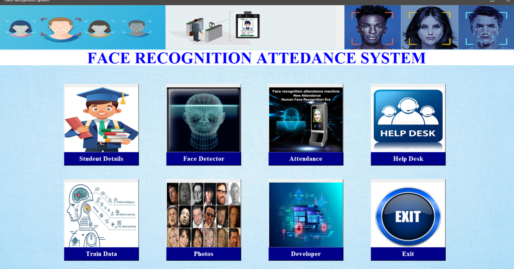
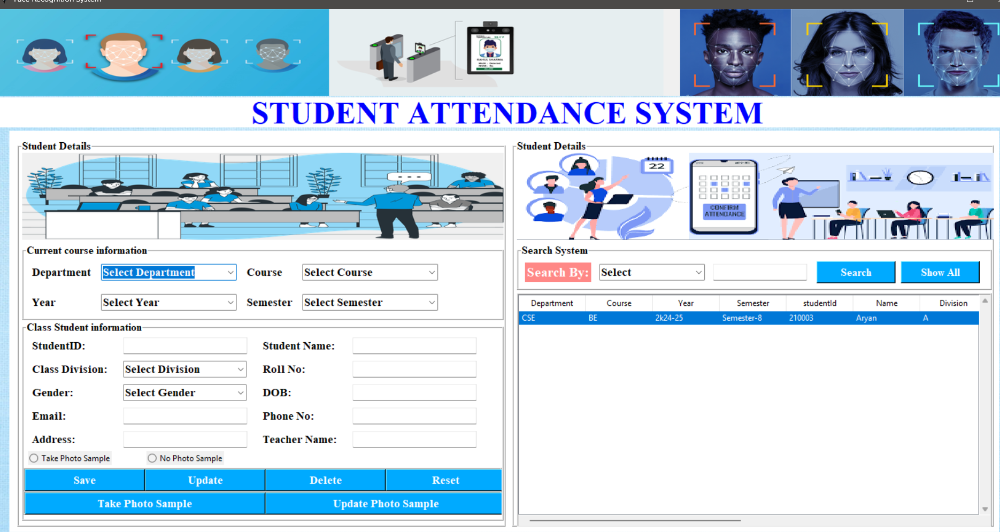

# Face Recognition Attendance System

A desktop application to manage student records and mark attendance using **real-time face recognition**. Built with **Python (Tkinter GUI)**, **OpenCV (LBPH)**, and **MySQL** for persistence. The app includes dedicated modules for **Student**, **Train**, **Face Recognition**, **Attendance**, **Developer**, and **Help**.

---

## ✨ Features

* **Student Management:** Add, update, delete, and search student profiles with photos.
* **Dataset Capture:** Capture multiple face images per student with webcam.
* **Model Training:** Train an **LBPH** face recognizer from the captured dataset.
* **Real-Time Recognition:** Detect and recognize students live and auto-mark attendance.
* **Attendance Log:** Save attendance with date/time; export to CSV.
* **Tkinter UI:** Simple, multi-window interface with buttons for each module.
* **MySQL Backend:** Store student and attendance data in a relational database.
* **Lightweight & Offline:** Runs locally; works without internet after setup.

---

## 🧱 Tech Stack

* **Language:** Python ≥ 3.9
* **GUI:** Tkinter
* **Computer Vision:** OpenCV (Haar Cascade + LBPH)
* **Database:** MySQL (InnoDB)
* **ORM/Driver:** `mysql-connector-python` (or `pymysql`)
* **Other:** `Pillow`, `numpy`, `pandas`

---

## 📂 Project Structure  

```
📁 Face-Recognition-Attendance-System  
│── main.py  
│── student.py  
│── train.py  
│── face_recognition.py  
│── attendance.py  
│── developer.py  
│── help.py  
│── requirements.txt  
│── haarcascade_frontalface_default.xml  
│── classifier.xml   (auto-generated)  
│── Ajay.csv         (attendance file)  
│
├── 📁 data/             # Captured student images  
├── 📁 college_images/   # GUI related images  
```  

> Your existing modules (Student, Train, Face Recognition, Attendance, Developer, Help) map directly to `modules/` above.

---

## 🗄️ Database Setup  

   ```sql
   >>>>>>> 6f90ecb
             CREATE DATABASE IF NOT EXISTS face_recognizer;
             USE face_recognizer;

       CREATE TABLE IF NOT EXISTS student (
       Dep VARCHAR(50),
       Course VARCHAR(50),
       Year VARCHAR(20),
       Semester VARCHAR(20),
       Student_id INT PRIMARY KEY,
       Name VARCHAR(100),
       Division VARCHAR(10),
       Roll VARCHAR(20),
       Gender VARCHAR(10),
       Dob VARCHAR(20),
       Email VARCHAR(100),
       Phone VARCHAR(20),
       Address VARCHAR(255),
       Teacher VARCHAR(100),
       PhotoSample VARCHAR(10)
       );
   ```

---

## 🔧 Installation

### 1) Prerequisites

* Python 3.9+ (3.10 recommended)
* MySQL Server 8.0+
* A working webcam
* OS: Windows 10/11 or Linux (Ubuntu 20.04+)

### 2) Clone & Create Virtual Environment

```bash
git clone <your-repo-url> face-recognition-attendance
cd face-recognition-attendance
python -m venv .venv
# Windows
.\.venv\Scripts\activate
# Linux/Mac
source .venv/bin/activate
```

### 3) Install Dependencies

```bash
pip install --upgrade pip
pip install -r requirements.txt
```

**requirements.txt (sample):**

```
opencv-python
numpy
pillow
pandas
mysql-connector-python
python-dotenv
```

### 4) Configure Environment

Create a `.env` file in project root:

```
DB_HOST=localhost
DB_PORT=3306
DB_USER=root
DB_PASSWORD=your_password
DB_NAME=fr_attendance
```

### 5) Initialize Database

* Create the database and tables using the SQL above.
* Update `.env` with your credentials.

### 6) Run the App

```bash
python app.py
```

---

## 🧠 How It Works (Pipeline)

1. **Register Student →** Enter student details (roll no, name, dept...).
2. **Capture Dataset →** App opens webcam and saves \~50–200 cropped face images for that student under `data/dataset/<roll_no>/`.
3. **Train Model →** Read all datasets, compute **LBPH** embeddings, and write model to `data/trainer/trainer.yml`.
4. **Recognize & Mark →** Live camera detects face, predicts ID using LBPH. On confident match (e.g., confidence ≤ 60), marks **Present** with timestamp.
5. **Review Attendance →** View logs by date/student; export CSV.

---

## ▶️ Usage

* **Student Module:** Add/edit/delete students, capture photos.
* **Train Module:** Click *Train* to regenerate `trainer.yml` after any dataset change.
* **Face Recognition:** Start camera → app overlays name/roll no → attendance auto-logs.
* **Attendance Module:** Filter by date/roll no → export to CSV in `data/attendance/`.
* **Developer/Help:** About info and common fixes.

---

## ⚙️ Key Configuration (config.py)

```python
HAAR_CASCADE = 'resources/haarcascades/haarcascade_frontalface_default.xml'
DATASET_DIR = 'data/dataset'
TRAINER_FILE = 'data/trainer/trainer.yml'
ATTENDANCE_DIR = 'data/attendance'
LBPH_PARAMS = dict(radius=1, neighbors=8, grid_x=8, grid_y=8)
RECOG_THRESHOLD = 60  # lower is stricter; tune based on lighting/camera
CAMERA_INDEX = 0
```

---

## 🧪 Sample Code Snippets

🏠 Home Page
## 🎬 Demo



👨‍🎓 Student Management
## 🎬 Demo


📊 Attendance Sheet
## 🎬 Demo


🎥 fill attendance Manually
## 🎬 Demo


🎥 Face Recognition in Action
## 🎬 Demo


### Face Detection (Haar)

```python
face_cascade = cv2.CascadeClassifier(HAAR_CASCADE)
gray = cv2.cvtColor(frame, cv2.COLOR_BGR2GRAY)
faces = face_cascade.detectMultiScale(gray, 1.3, 5)
for (x,y,w,h) in faces:
    roi = gray[y:y+h, x:x+w]
```

### LBPH Training

```python
recognizer = cv2.face.LBPHFaceRecognizer_create(**LBPH_PARAMS)
recognizer.train(images, np.array(labels))
recognizer.save(TRAINER_FILE)
```

### Prediction → Attendance

```python
label, conf = recognizer.predict(roi)
if conf <= RECOG_THRESHOLD:
    mark_attendance(student_id=label)
```

---

## 📊 Attendance CSV Format

```
roll_no,name,status,marked_at,session_date
CS23-001,Ananya Gupta,Present,2025-08-23 10:04:11,2025-08-23
```

---

## 🔐 Privacy & Security

* Store only necessary student data; avoid sensitive identifiers.
* Keep dataset images and `trainer.yml` private.
* Use strong DB password; restrict DB user privileges.
* Consider consent forms for data collection.

---

## 🛠️ Troubleshooting

* **`cv2.error: (-215:Assertion failed) camera...`** → Wrong `CAMERA_INDEX`; try 0/1; ensure camera not used by other apps.
* **`ModuleNotFoundError`** → Activate venv and reinstall `pip install -r requirements.txt`.
* **Images saved but not recognized** → Capture more images (vary angles/lighting); retrain; adjust `RECOG_THRESHOLD`.
* **MySQL `Access denied`** → Check `.env` credentials and user grants.
* **Haar cascade not found** → Verify path in `config.py`.

---

## 🚀 Performance Tips

* Capture 100–200 images per student across lighting/angles.
* Ensure face is centered and well-lit during capture.
* Periodically retrain after adding new students.
* Consider **CLAHE**/histogram equalization on grayscale frames.

---

## 🗺️ Roadmap

* [ ] Multi-camera support
* [ ] Admin login & roles
* [ ] Attendance dashboard with charts
* [ ] CSV import for students
* [ ] Model versioning & backups
* [ ] Optional: Deep-learning embedding (e.g., FaceNet) with SVM classifier

---

## 🤝 Contributing

1. Fork the repo
2. Create feature branch: `git checkout -b feat/my-feature`
3. Commit: `git commit -m "feat: add my-feature"`
4. Push: `git push origin feat/my-feature`
5. Open a PR


---

## 🙏 Acknowledgements

* OpenCV community & docs
* Haar cascade from OpenCV
* Inspiration from standard LBPH attendance demos

---

## 📎 Appendix: Quick Start Commands (Windows)

```bat
py -3 -m venv .venv
.\.venv\Scripts\activate
pip install -r requirements.txt
set DB_HOST=localhost
set DB_USER=root
set DB_PASSWORD=your_password
set DB_NAME=fr_attendance
python app.py
```

